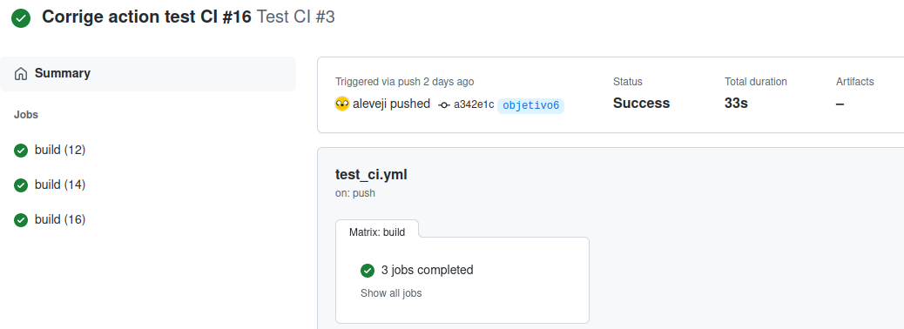
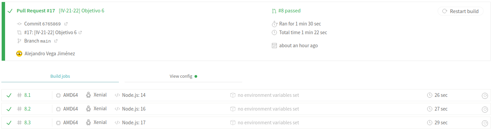
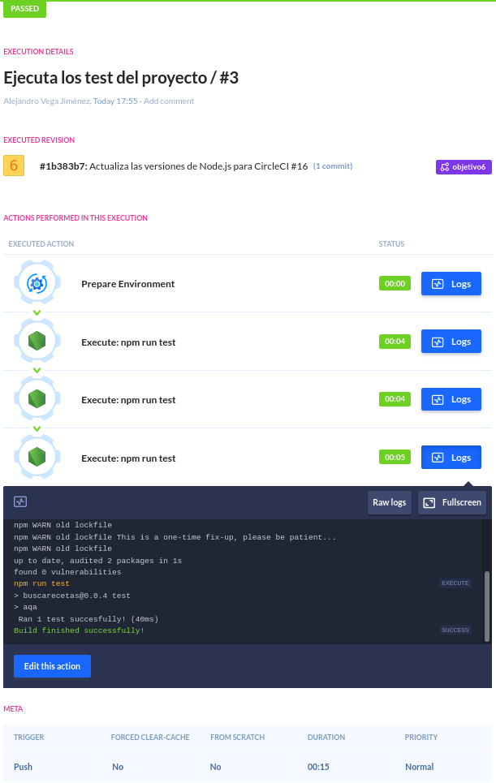
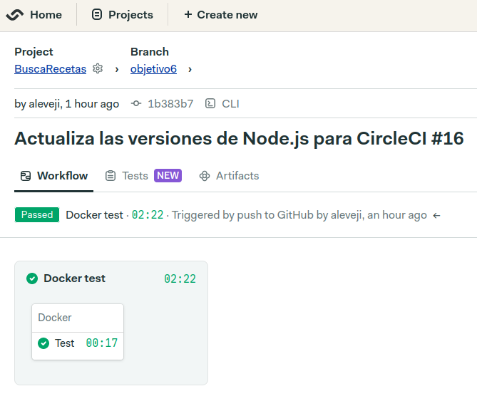
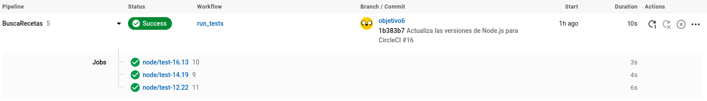

# CI

Requisitos:
* Que sea rápido
* Que sea gratuito o tenga una prueba para ver si merece la pena una posible inversión
* Que funcione con Node.js y permita probar diferentes versiones
* Que se pueda integrar con GitHub
* Que sea sencillo de configurar

Versiones:
Para las pruebas decidí utilizar las versiones 12, 14 y 16 ya que son las versiones LTS
actualmente disponibles y cuentan con un tiempo de soporte asegurado mayor que las demás.
Aun así, para comparar con las otras versiones, en alguna prueba decidí utilizar la 17,
que es la última versión disponible a pesar de no ser LTS.

## Azure Pipelines
Configuración:
 - Registrarse con GitHub
 - Crear el archivo YAML y subirlo a GitHub
 - Una vez subido el archivo, seleccionar el repo y la rama en la que se encuentra el fichero
 - Ejecutar manualmente
 - Al ejecutarlo por primera vez saldrá un error con una dirección en la que tendremos
 que rellenar un formulario para solicitar la prueba gratuita

No es complicado de configurar pero tener que enviar un formulario y esperar que aprueben tu
solicitud me parece engorroso.

## GitHub Actions
Está integrado directamente en GitHub y es totalmente gratuito. Al haberlo utilizado en el hito
anterior, su configuración es muy sencilla, basta con añadir un nuevo fichero YAML a la carpeta
de _workflows_ e indicar:
 - Las condiciones para que se lance la "action"
 - Las tareas a realizar
 - Las diferentes versiones con las que probar las tareas

## Travis CI
Este servicio es sencillo de utilizar y cuenta con una prueba de 30 días.
Configuración:
 - Registrarse con GitHub
 - Seleccionar el repo que se va a utilizar
 - Pushear un fichero YAML con la tarea a realizar y las versiones a probar

A pesar de ser fácil de utilizar, me dio problemas para conseguir sincronizarse con GitHub.

## Buddy
A pesar de contar con una prueba de solo 14 dias, este servicio es el más facil de configurar
que he probado. Para configurarlo basta con:
 - Registrarse con GitHub
 - Seleccionar un repo
 - Añadir un nuevo "pipeline"
 - Seleccionar las condiciones para que se ejecute desde un formulario
 - Elegir las acciones a realizar y las versiones correspondientes

De este servicio destaco su facilidad de configuración ya que ni siquiera hay que crear un
fichero de configuración YAML como en el resto de servicios.

## Semaphore CI
Al igual que Buddy, cuenta con una prueba de 14 días y para configurarlo hay que:
 - Registrarse con GitHub
 - Seleccionar el repo
 - Crear el archivo YAML desde la propia web

En este servicio aproveché para ejecutar los test en el docker creado en el hito anterior y
resultó fácil de configurar.

## CircleCI
Decidí probar CircleCI ya que muchos compañeros lo habían utilizado y quería saber el motivo.
Este servicio fue el más rápido de todos.
Configuración:
 - Registrarse con GitHub
 - Seleccionar el repo a utilizar
 - Crear el fichero YAML, bien desde una plantilla o desde cero

Este servicio es muy parecido a Semaphore y las plantillas me facilitaron la configuración,
pero tuve problemas ya que a pesar de subir con antelación al repo el fichero YAML me
indicaba que no existía ningún fichero de configuración. Tras crear el mismo fichero desde
la web en una nueva rama del repo observé que fallaba porque para este servicio es
necesario indicar una version _minor_, por lo que puse las últimas disponibles ya que son
las más actualizadas.

### Conclusión
A pesar de que todas las opciones probadas cumplen con los requisitos establecidos, mis 2
elecciones son **Buddy** porque ha sido una de las más rápidas y es la más sencilla de
configurar que he probado y **GitHub Actions** ya que, como es obvio, está integrado en GitHub,
es muy versátil y es totalmente gratuita para los repositorios públicos, como es el caso.

