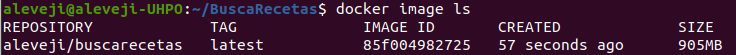
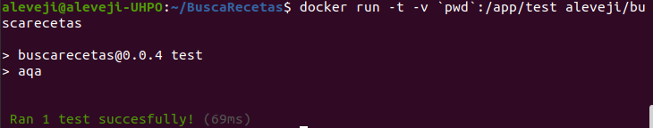
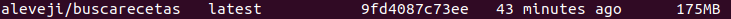
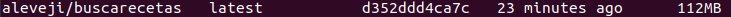

# Elección imagen docker
## node:16.13.0-slim

Criterios de elección de la imagen de Docker:
 - Soporte para la versión que utilizo de Node.js (v16.13.0) ya que todo lo utilizo para mi proyecto
 me funciona correctamente en dicha versión
 - Actualizada recientemente para evitar posibles vulnerabilidades
 - Alto rendimiento
 - Que sea liviana

Al principió opté por tres versiones que se adaptaban a mis criterios:
 - node:16.13.0 -> la versión estándar de la imagen oficial de node que cuenta con muchas herramientas ya instaladas
 - node:16.13.0-slim -> imagen oficial de node que cuenta con lo mínimo para ejecutar node
 - node:16.13.0-alpine -> imagen oficial de node basada en Alpine con tamaño muy reducido

Las tres opciones soportaban mi versión de Node.js y estaban actualizas recientemente, por lo que para quedarme con
una realicé pruebas para elegir la que mejor rendimiento tuviera:
 - node:16.13.0 -> 69ms
 
   
   
   
 
 - node:16.13.0-slim -> **68ms**
 
   
   
   
 
 - node:16.13.0-alpine -> 84ms
 
   
   
   

