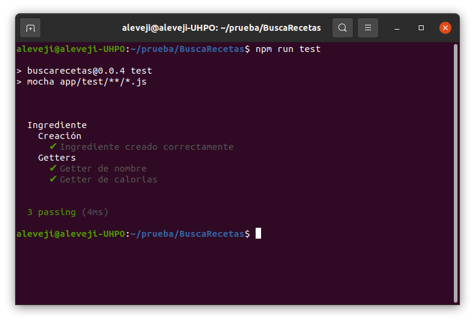
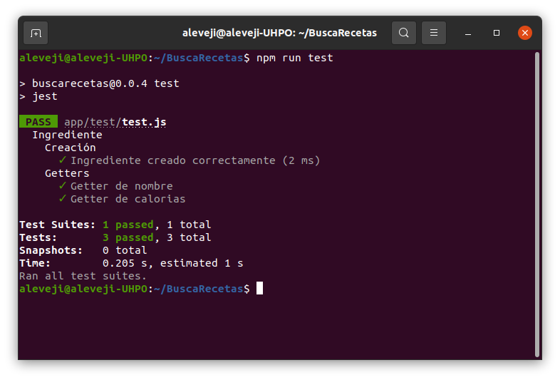

# Elección framework test
## Mocha
Para ejecutar los test de mi proyecto estaba indeciso entre Mocha y Jest, pero finalmente me decidí
por Mocha ya que es uno de los frameworks más antiguos y cuenta con una gran comunidad. Además, trás
ejecutar un test sencillo con ambos frameworks he obtenido mejores resultados con Mocha que con Jest
como se puede observar en las imágenes. Por último, como biblioteca de aserciones he decidido
utilizar _assert_ que viene incluido con Node.js para no instalar más dependencias adicionales ya que,
aunque es sencillo, por ahora cubre mis necesidades para elaborar los test de mi proyecto.

Test **Mocha**:

Test **Jest**:

