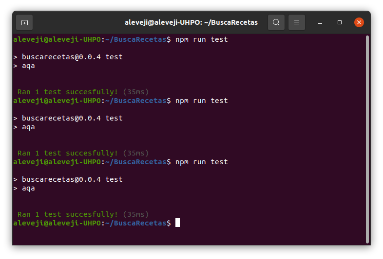

# Elección framework test
## aqa
Para ejecutar los test de mi proyecto finalmente me he decidido por aqa ya que es un test runner
que no tiene ninguna dependencia y es muy liviano, ocupa 41.7 kB en comparación con los 3.79 MB
de Mocha. Además, es rápido, solo tarda en ejecutar el test unos 35 ms de media, y está actualizado,
la última versión se publicó 9 días antes de escribir esto. Por último, a pesar de ser un test runner,
aqa incluye algunas funciones _assert_ básicas que por ahora me sirven para los tests de mi proyecto,
por lo que las voy a utilizar mientras me sean útiles para no tener que instalar dependencias
adicionales.

Test **aqa**:

